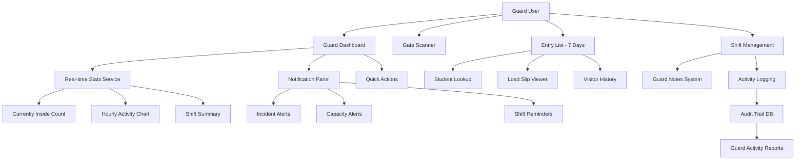
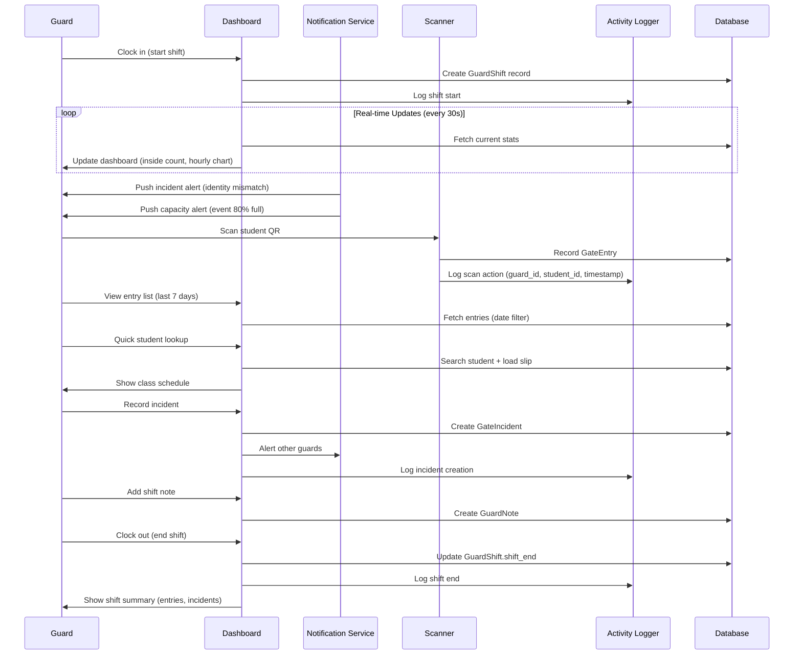

# Design Document: Guard Account Enhancements

## Overview

This design enhances the City College of Bayawan gate management system with six major improvements to the guard account functionality. The enhancements focus on real-time notifications, expanded historical access, guard-specific features, improved dashboard UI, comprehensive activity logging, and additional tools for shift handovers and visitor management. These improvements will make guards more informed, accountable, and efficient in their daily operations while maintaining security boundaries and audit trail integrity.

The system currently provides basic guard functionality (dashboard, scanner, clock in/out, today-only entry view, incident reporting). This design extends these capabilities with notification alerts, 7-day history access, performance metrics, real-time dashboard updates, detailed activity logging, and mobile-responsive improvements.

## Architecture

The guard enhancements integrate into the existing Django application architecture with minimal structural changes. The design follows the current pattern of context processors for global data, view functions for business logic, and template-based UI rendering.



## Main Workflow: Guard Daily Operations with Enhancements



## Components and Interfaces

### Component 1: Guard Notification Service

**Purpose**: Deliver real-time alerts to guards for incidents, capacity warnings, shift reminders, and suspicious activity.

**Interface**:
```python
class GuardNotificationService:
    def create_incident_alert(incident: GateIncident, target_guards: List[User]) -> GuardNotification
    def create_capacity_alert(event: Event, current_count: int, target_guards: List[User]) -> GuardNotification
    def create_shift_reminder(shift: GuardShift, minutes_remaining: int) -> GuardNotification
    def create_suspicious_activity_alert(details: str, target_guards: List[User]) -> GuardNotification
    def get_unread_notifications(guard: User) -> QuerySet[GuardNotification]
    def mark_as_read(notification_id: int, guard: User) -> bool
```

**Responsibilities**:
- Create typed notifications for different alert scenarios
- Target specific guards or broadcast to all on-duty guards
- Track read/unread status per guard
- Provide notification count for navbar badge
- Support real-time delivery via polling or WebSocket (future)

### Component 2: Guard History Access Manager

**Purpose**: Provide guards with read access to the last 7 days of gate entries, visitor logs, and incident reports.

**Interface**:
```python
class GuardHistoryManager:
    def get_entries_last_7_days(guard: User, filters: dict) -> QuerySet[GateEntry]
    def get_visitor_history_last_7_days(guard: User) -> QuerySet[VisitorVisit]
    def get_incidents_last_7_days(guard: User) -> QuerySet[GateIncident]
    def get_weekly_summary(guard: User, week_start: date) -> dict
    def get_monthly_summary(guard: User, month: int, year: int) -> dict
    def can_access_date(guard: User, target_date: date) -> bool
```

**Responsibilities**:
- Enforce 7-day access window for guards (admin/supervisor unlimited)
- Aggregate weekly and monthly statistics
- Filter entries by date range, student, scan type
- Provide summary reports for guard review

### Component 3: Guard Performance Tracker

**Purpose**: Calculate and display guard-specific performance metrics for accountability and improvement.

**Interface**:
```python
class GuardPerformanceTracker:
    def get_shift_metrics(shift: GuardShift) -> dict
    def calculate_scans_per_hour(guard: User, shift: GuardShift) -> float
    def calculate_accuracy_rate(guard: User, date_range: tuple) -> float
    def get_incident_response_time(guard: User, date_range: tuple) -> timedelta
    def get_performance_summary(guard: User, period: str) -> dict
```

**Responsibilities**:
- Track scans per hour during active shifts
- Calculate accuracy rate (successful scans / total attempts)
- Measure incident response times
- Generate daily/weekly/monthly performance summaries
- Provide comparative metrics (guard vs. average)

### Component 4: Real-time Dashboard Service

**Purpose**: Provide live-updating statistics and activity feed for the guard dashboard.

**Interface**:
```python
class RealtimeDashboardService:
    def get_current_stats() -> dict
    def get_currently_inside_count() -> int
    def get_hourly_activity_chart(date: date) -> dict
    def get_recent_activity_feed(limit: int) -> List[dict]
    def get_shift_summary(shift: GuardShift) -> dict
    def get_active_alerts() -> List[GuardNotification]
```

**Responsibilities**:
- Fetch current inside count (students on campus)
- Generate hourly activity chart data (entries per hour)
- Provide recent activity feed (last 20 scans)
- Calculate shift-specific statistics
- Aggregate active alerts for notification panel
- Support auto-refresh via AJAX polling

### Component 5: Guard Activity Logger

**Purpose**: Comprehensive audit trail for all guard actions with detailed context.

**Interface**:
```python
class GuardActivityLogger:
    def log_scan(guard: User, entry: GateEntry, device_id: str, ip: str) -> GuardActivityLog
    def log_override(guard: User, entry: GateEntry, reason: str, original_result: str) -> GuardActivityLog
    def log_incident_creation(guard: User, incident: GateIncident) -> GuardActivityLog
    def log_shift_action(guard: User, action: str, shift: GuardShift) -> GuardActivityLog
    def log_note_creation(guard: User, note: GuardNote) -> GuardActivityLog
    def get_guard_activity(guard: User, date_range: tuple) -> QuerySet[GuardActivityLog]
    def get_shift_activity(shift: GuardShift) -> QuerySet[GuardActivityLog]
```

**Responsibilities**:
- Log every guard action with timestamp, user, and context
- Track override decisions with reasons
- Record incident creation and resolution
- Log shift clock in/out events
- Provide queryable audit trail for accountability
- Support filtering by guard, date, action type

### Component 6: Guard Notes System

**Purpose**: Enable shift handover notes and communication between guards across shifts.

**Interface**:
```python
class GuardNotesManager:
    def create_note(guard: User, content: str, priority: str, shift: GuardShift) -> GuardNote
    def get_recent_notes(limit: int) -> QuerySet[GuardNote]
    def get_unread_notes(guard: User) -> QuerySet[GuardNote]
    def mark_note_read(note_id: int, guard: User) -> bool
    def search_notes(query: str, date_range: tuple) -> QuerySet[GuardNote]
```

**Responsibilities**:
- Create shift handover notes with priority levels
- Display recent notes to incoming guards
- Track which guards have read each note
- Support search and filtering by date/priority
- Enable communication across shifts

### Component 7: Student Lookup Service

**Purpose**: Quick student verification with class schedule and identity information.

**Interface**:
```python
class StudentLookupService:
    def lookup_by_id(student_id: str) -> dict
    def lookup_by_name(name: str) -> List[dict]
    def get_current_schedule(student: Student, datetime: datetime) -> List[LoadSlipSubject]
    def get_today_schedule(student: Student, date: date) -> List[LoadSlipSubject]
    def verify_class_time(student: Student, datetime: datetime) -> bool
    def get_recent_entries(student: Student, days: int) -> QuerySet[GateEntry]
```

**Responsibilities**:
- Search students by ID or name
- Retrieve current load slip and schedule
- Verify if student has class at specific time
- Show recent entry history for verification
- Provide photo and identity details for visual confirmation

## Data Models

### Model 1: GuardNotification

```python
class GuardNotification(models.Model):
    NOTIFICATION_TYPE_CHOICES = (
        ('incident', 'Incident Alert'),
        ('capacity', 'Capacity Alert'),
        ('shift_reminder', 'Shift Reminder'),
        ('suspicious', 'Suspicious Activity'),
        ('system', 'System Message'),
    )
    
    PRIORITY_CHOICES = (
        ('low', 'Low'),
        ('medium', 'Medium'),
        ('high', 'High'),
        ('urgent', 'Urgent'),
    )
    
    notification_type = models.CharField(max_length=20, choices=NOTIFICATION_TYPE_CHOICES, db_index=True)
    priority = models.CharField(max_length=10, choices=PRIORITY_CHOICES, default='medium')
    title = models.CharField(max_length=200)
    message = models.TextField()
    target_guard = models.ForeignKey(User, on_delete=models.CASCADE, related_name='guard_notifications', null=True, blank=True)
    broadcast = models.BooleanField(default=False)
    related_incident = models.ForeignKey(GateIncident, on_delete=models.SET_NULL, null=True, blank=True)
    related_event = models.ForeignKey(Event, on_delete=models.SET_NULL, null=True, blank=True)
    related_entry = models.ForeignKey(GateEntry, on_delete=models.SET_NULL, null=True, blank=True)
    is_read = models.BooleanField(default=False, db_index=True)
    read_at = models.DateTimeField(null=True, blank=True)
    created_at = models.DateTimeField(auto_now_add=True, db_index=True)
    expires_at = models.DateTimeField(null=True, blank=True)
```

**Validation Rules**:
- Either target_guard must be set OR broadcast must be True
- Priority 'urgent' requires notification_type in ('incident', 'suspicious')
- expires_at must be after created_at if set
- title max 200 characters, message max 1000 characters

### Model 2: GuardNote

```python
class GuardNote(models.Model):
    PRIORITY_CHOICES = (
        ('normal', 'Normal'),
        ('important', 'Important'),
        ('urgent', 'Urgent'),
    )
    
    guard = models.ForeignKey(User, on_delete=models.CASCADE, related_name='guard_notes_created')
    shift = models.ForeignKey(GuardShift, on_delete=models.SET_NULL, null=True, blank=True, related_name='notes')
    priority = models.CharField(max_length=10, choices=PRIORITY_CHOICES, default='normal')
    content = models.TextField()
    created_at = models.DateTimeField(auto_now_add=True, db_index=True)
    updated_at = models.DateTimeField(auto_now=True)
```

**Validation Rules**:
- content required, max 2000 characters
- guard must be in Guard group
- shift optional (can create notes outside active shift)
- priority 'urgent' should trigger notification to next shift

### Model 3: GuardNoteRead

```python
class GuardNoteRead(models.Model):
    note = models.ForeignKey(GuardNote, on_delete=models.CASCADE, related_name='reads')
    guard = models.ForeignKey(User, on_delete=models.CASCADE, related_name='notes_read')
    read_at = models.DateTimeField(auto_now_add=True)
    
    class Meta:
        unique_together = [['note', 'guard']]
```

**Validation Rules**:
- Unique per note + guard combination
- Cannot mark own notes as read (auto-read on creation)

### Model 4: GuardActivityLog

```python
class GuardActivityLog(models.Model):
    ACTION_TYPE_CHOICES = (
        ('scan', 'Gate Scan'),
        ('override', 'Override Decision'),
        ('incident', 'Incident Report'),
        ('shift_start', 'Shift Clock In'),
        ('shift_end', 'Shift Clock Out'),
        ('note', 'Note Created'),
        ('visitor_checkin', 'Visitor Check-in'),
        ('visitor_checkout', 'Visitor Check-out'),
        ('early_out', 'Early Out Recorded'),
        ('lookup', 'Student Lookup'),
    )
    
    guard = models.ForeignKey(User, on_delete=models.CASCADE, related_name='activity_logs', db_index=True)
    action_type = models.CharField(max_length=20, choices=ACTION_TYPE_CHOICES, db_index=True)
    description = models.TextField()
    related_entry = models.ForeignKey(GateEntry, on_delete=models.SET_NULL, null=True, blank=True)
    related_incident = models.ForeignKey(GateIncident, on_delete=models.SET_NULL, null=True, blank=True)
    related_shift = models.ForeignKey(GuardShift, on_delete=models.SET_NULL, null=True, blank=True)
    related_student = models.ForeignKey(Student, on_delete=models.SET_NULL, null=True, blank=True)
    device_id = models.CharField(max_length=128, blank=True)
    ip_address = models.GenericIPAddressField(null=True, blank=True)
    metadata = models.JSONField(default=dict, blank=True)
    timestamp = models.DateTimeField(auto_now_add=True, db_index=True)
```

**Validation Rules**:
- guard must be in Guard group
- description required, max 500 characters
- metadata JSON for additional context (e.g., override reason, original result)
- At least one related_* field should be set for context

### Model 5: GuardPerformanceMetrics (Computed)

```python
# Not a database model - computed on-demand from existing data
class GuardPerformanceMetrics:
    guard: User
    period_start: datetime
    period_end: datetime
    total_scans: int
    successful_scans: int
    denied_scans: int
    accuracy_rate: float  # successful / total
    scans_per_hour: float
    incidents_reported: int
    overrides_made: int
    average_response_time: timedelta  # for incidents
    shifts_worked: int
    total_hours: float
```

**Calculation Logic**:
- total_scans = GateEntry.objects.filter(recorded_by=guard, timestamp__range=(start, end)).count()
- successful_scans = GateEntry.objects.filter(recorded_by=guard, granted=True, timestamp__range=(start, end)).count()
- accuracy_rate = successful_scans / total_scans if total_scans > 0 else 0
- scans_per_hour = total_scans / total_hours if total_hours > 0 else 0
- incidents_reported = GateIncident.objects.filter(timestamp__range=(start, end), related to guard actions).count()
- shifts_worked = GuardShift.objects.filter(guard=guard, shift_start__range=(start, end)).count()
- total_hours = sum of (shift_end - shift_start) for all shifts in period

## Algorithmic Pseudocode

### Algorithm 1: Create Incident Alert for Guards

```pascal
ALGORITHM createIncidentAlert(incident, broadcast)
INPUT: incident of type GateIncident, broadcast of type boolean
OUTPUT: notification of type GuardNotification

BEGIN
  ASSERT incident IS NOT NULL
  ASSERT incident.reason IN ['identity_mismatch', 'invalid_id', 'proxy_attendance', 'other']
  
  // Determine priority based on incident reason
  IF incident.reason = 'proxy_attendance' OR incident.reason = 'identity_mismatch' THEN
    priority ← 'high'
  ELSE
    priority ← 'medium'
  END IF
  
  // Build notification message
  IF incident.student IS NOT NULL THEN
    title ← "Incident: " + incident.reason + " - " + incident.student.student_id
    message ← "Student: " + incident.student.get_full_name() + "\n"
    message ← message + "Reason: " + incident.get_reason_display() + "\n"
    message ← message + "Details: " + incident.details
  ELSE
    title ← "Incident: " + incident.reason
    message ← "Scanned ID: " + incident.scanned_id + "\n"
    message ← message + "Reason: " + incident.get_reason_display() + "\n"
    message ← message + "Details: " + incident.details
  END IF
  
  // Create notification
  IF broadcast = TRUE THEN
    // Broadcast to all guards currently on duty
    active_shifts ← GuardShift.objects.filter(shift_end IS NULL)
    FOR EACH shift IN active_shifts DO
      notification ← GuardNotification.create(
        notification_type='incident',
        priority=priority,
        title=title,
        message=message,
        target_guard=shift.guard,
        broadcast=TRUE,
        related_incident=incident,
        created_at=NOW()
      )
      notification.save()
    END FOR
  ELSE
    // Single notification (for specific guard context)
    notification ← GuardNotification.create(
      notification_type='incident',
      priority=priority,
      title=title,
      message=message,
      broadcast=FALSE,
      related_incident=incident,
      created_at=NOW()
    )
    notification.save()
  END IF
  
  RETURN notification
END
```

**Preconditions**:
- incident is a valid GateIncident object
- incident.reason is one of the defined choices
- If broadcast=True, at least one guard must be on duty

**Postconditions**:
- GuardNotification record(s) created in database
- Notification(s) marked as unread (is_read=False)
- If broadcast=True, one notification per active guard
- related_incident foreign key set correctly

### Algorithm 2: Check Event Capacity and Alert Guards

```pascal
ALGORITHM checkEventCapacityAndAlert(event)
INPUT: event of type Event
OUTPUT: alert_sent of type boolean

BEGIN
  ASSERT event IS NOT NULL
  ASSERT event.maximum_attende > 0
  
  // Count current attendees (checked in, not yet checked out)
  current_count ← EventAttendance.objects.filter(
    event=event,
    checked_in_at IS NOT NULL,
    checked_out_at IS NULL
  ).count()
  
  // Calculate capacity percentage
  capacity_percentage ← (current_count / event.maximum_attende) * 100
  
  // Check if alert threshold reached (80%)
  IF capacity_percentage >= 80 AND capacity_percentage < 100 THEN
    // Check if alert already sent recently (within last hour)
    one_hour_ago ← NOW() - timedelta(hours=1)
    
    IF event.capacity_alert_sent_at IS NULL OR event.capacity_alert_sent_at < one_hour_ago THEN
      // Create capacity alert for all guards
      title ← "Capacity Alert: " + event.name
      message ← "Event is at " + ROUND(capacity_percentage) + "% capacity\n"
      message ← message + "Current: " + current_count + " / " + event.maximum_attende + "\n"
      message ← message + "Location: " + event.venue
      
      // Broadcast to all on-duty guards
      active_shifts ← GuardShift.objects.filter(shift_end IS NULL)
      FOR EACH shift IN active_shifts DO
        notification ← GuardNotification.create(
          notification_type='capacity',
          priority='medium',
          title=title,
          message=message,
          target_guard=shift.guard,
          broadcast=TRUE,
          related_event=event,
          created_at=NOW()
        )
        notification.save()
      END FOR
      
      // Update event to mark alert sent
      event.capacity_alert_sent_at ← NOW()
      event.save()
      
      RETURN TRUE
    END IF
  END IF
  
  RETURN FALSE
END
```

**Preconditions**:
- event is a valid Event object with maximum_attende > 0
- EventAttendance records exist for the event
- GuardShift records exist for on-duty guards

**Postconditions**:
- If capacity >= 80%, GuardNotification records created for all on-duty guards
- event.capacity_alert_sent_at updated to current timestamp
- Alert not sent more than once per hour for same event
- Returns True if alert was sent, False otherwise

**Loop Invariants**:
- All active_shifts have shift_end = NULL (guards currently on duty)
- Each notification created has unique target_guard

### Algorithm 3: Calculate Guard Performance Metrics

```pascal
ALGORITHM calculateGuardPerformanceMetrics(guard, period_start, period_end)
INPUT: guard of type User, period_start of type datetime, period_end of type datetime
OUTPUT: metrics of type GuardPerformanceMetrics

BEGIN
  ASSERT guard IS NOT NULL
  ASSERT guard IS IN Guard group
  ASSERT period_start < period_end
  
  // Initialize metrics object
  metrics ← GuardPerformanceMetrics()
  metrics.guard ← guard
  metrics.period_start ← period_start
  metrics.period_end ← period_end
  
  // Calculate scan statistics
  all_entries ← GateEntry.objects.filter(
    recorded_by=guard,
    timestamp >= period_start,
    timestamp < period_end
  )
  
  metrics.total_scans ← all_entries.count()
  metrics.successful_scans ← all_entries.filter(granted=TRUE).count()
  metrics.denied_scans ← all_entries.filter(granted=FALSE).count()
  
  // Calculate accuracy rate
  IF metrics.total_scans > 0 THEN
    metrics.accuracy_rate ← (metrics.successful_scans / metrics.total_scans) * 100
  ELSE
    metrics.accuracy_rate ← 0
  END IF
  
  // Calculate shift statistics
  shifts ← GuardShift.objects.filter(
    guard=guard,
    shift_start >= period_start,
    shift_start < period_end
  )
  
  metrics.shifts_worked ← shifts.count()
  total_hours ← 0
  
  FOR EACH shift IN shifts DO
    IF shift.shift_end IS NOT NULL THEN
      duration ← shift.shift_end - shift.shift_start
      total_hours ← total_hours + (duration.total_seconds() / 3600)
    ELSE
      // Ongoing shift: calculate up to now
      duration ← NOW() - shift.shift_start
      total_hours ← total_hours + (duration.total_seconds() / 3600)
    END IF
  END FOR
  
  metrics.total_hours ← total_hours
  
  // Calculate scans per hour
  IF total_hours > 0 THEN
    metrics.scans_per_hour ← metrics.total_scans / total_hours
  ELSE
    metrics.scans_per_hour ← 0
  END IF
  
  // Calculate incident statistics
  activity_logs ← GuardActivityLog.objects.filter(
    guard=guard,
    timestamp >= period_start,
    timestamp < period_end
  )
  
  metrics.incidents_reported ← activity_logs.filter(action_type='incident').count()
  metrics.overrides_made ← activity_logs.filter(action_type='override').count()
  
  // Calculate average incident response time
  incident_logs ← activity_logs.filter(action_type='incident')
  IF incident_logs.count() > 0 THEN
    total_response_time ← 0
    response_count ← 0
    
    FOR EACH log IN incident_logs DO
      IF log.related_incident IS NOT NULL THEN
        // Response time = time between incident creation and guard action
        response_time ← log.timestamp - log.related_incident.timestamp
        total_response_time ← total_response_time + response_time.total_seconds()
        response_count ← response_count + 1
      END IF
    END FOR
    
    IF response_count > 0 THEN
      avg_seconds ← total_response_time / response_count
      metrics.average_response_time ← timedelta(seconds=avg_seconds)
    ELSE
      metrics.average_response_time ← timedelta(seconds=0)
    END IF
  ELSE
    metrics.average_response_time ← timedelta(seconds=0)
  END IF
  
  RETURN metrics
END
```

**Preconditions**:
- guard is a valid User object in the Guard group
- period_start < period_end
- Database contains GateEntry, GuardShift, and GuardActivityLog records

**Postconditions**:
- metrics object contains all calculated statistics
- accuracy_rate is between 0 and 100
- scans_per_hour >= 0
- total_hours >= 0
- All counts are non-negative integers

**Loop Invariants**:
- total_hours accumulates correctly for each shift
- total_response_time accumulates correctly for each incident
- All database queries filter by guard and date range

### Algorithm 4: Get Guard Entry History with 7-Day Restriction

```pascal
ALGORITHM getGuardEntryHistory(guard, filters)
INPUT: guard of type User, filters of type dict
OUTPUT: entries of type QuerySet[GateEntry]

BEGIN
  ASSERT guard IS NOT NULL
  
  // Determine user role
  user_role ← get_user_role(guard)
  
  // Extract filter parameters
  from_date ← filters.get('from_date', TODAY())
  to_date ← filters.get('to_date', TODAY())
  search_query ← filters.get('q', '')
  scan_type ← filters.get('scan_type', '')
  
  // Apply 7-day restriction for guards (not admin/supervisor)
  IF user_role = 'guard' THEN
    earliest_allowed ← TODAY() - timedelta(days=7)
    
    IF from_date < earliest_allowed THEN
      from_date ← earliest_allowed
    END IF
    
    IF to_date < earliest_allowed THEN
      to_date ← earliest_allowed
    END IF
    
    // Ensure to_date not in future
    IF to_date > TODAY() THEN
      to_date ← TODAY()
    END IF
  END IF
  
  // Build query
  day_start, day_end ← _local_day_bounds(from_date)
  to_day_start, to_day_end ← _local_day_bounds(to_date)
  
  entries ← GateEntry.objects.filter(
    timestamp >= day_start,
    timestamp < to_day_end
  ).select_related('student', 'incident', 'event').order_by('-timestamp')
  
  // Apply search filter
  IF search_query != '' THEN
    entries ← entries.filter(
      Q(student__student_id__icontains=search_query) OR
      Q(student__first_name__icontains=search_query) OR
      Q(student__last_name__icontains=search_query) OR
      Q(notes__icontains=search_query)
    )
  END IF
  
  // Apply scan type filter
  IF scan_type IN ['IN', 'OUT'] THEN
    entries ← entries.filter(scan_type=scan_type)
  END IF
  
  // Limit results
  entries ← entries[:500]
  
  RETURN entries
END
```

**Preconditions**:
- guard is a valid User object
- filters is a dictionary with optional keys: from_date, to_date, q, scan_type
- Date values in filters are valid date objects or ISO format strings

**Postconditions**:
- For guards: returned entries are within last 7 days only
- For admin/supervisor: no date restriction applied
- Results limited to 500 entries maximum
- Entries ordered by timestamp descending (newest first)
- Related student, incident, and event data pre-fetched

**Loop Invariants**:
- Date range always valid (from_date <= to_date)
- For guards: from_date >= (today - 7 days)

### Algorithm 5: Real-time Dashboard Stats Update

```pascal
ALGORITHM getRealTimeDashboardStats(guard)
INPUT: guard of type User
OUTPUT: stats of type dict

BEGIN
  ASSERT guard IS NOT NULL
  
  today ← TODAY()
  day_start, day_end ← _local_day_bounds(today)
  now ← NOW()
  
  // Initialize stats dictionary
  stats ← {}
  
  // Current shift information
  current_shift ← GuardShift.objects.filter(
    guard=guard,
    shift_end IS NULL
  ).order_by('-shift_start').first()
  
  IF current_shift IS NOT NULL THEN
    stats['shift_active'] ← TRUE
    stats['shift_start'] ← current_shift.shift_start
    shift_duration ← now - current_shift.shift_start
    stats['shift_hours'] ← shift_duration.total_seconds() / 3600
    
    // Entries during current shift
    shift_entries ← GateEntry.objects.filter(
      recorded_by=guard,
      timestamp >= current_shift.shift_start,
      timestamp <= now
    )
    stats['shift_entries'] ← shift_entries.count()
    stats['shift_entries_in'] ← shift_entries.filter(scan_type='IN').count()
    stats['shift_entries_out'] ← shift_entries.filter(scan_type='OUT').count()
  ELSE
    stats['shift_active'] ← FALSE
    stats['shift_entries'] ← 0
  END IF
  
  // Today's overall statistics
  entries_today ← GateEntry.objects.filter(
    timestamp >= day_start,
    timestamp < day_end
  )
  
  stats['total_entries_today'] ← entries_today.filter(granted=TRUE).count()
  stats['denied_entries_today'] ← entries_today.filter(granted=FALSE).count()
  stats['entries_in_today'] ← entries_today.filter(scan_type='IN', granted=TRUE).count()
  stats['entries_out_today'] ← entries_today.filter(scan_type='OUT', granted=TRUE).count()
  
  // Currently inside count
  stats['currently_inside'] ← _currently_inside_count(today)
  
  // Hourly activity chart (last 24 hours)
  hourly_data ← []
  FOR hour FROM 0 TO 23 DO
    hour_start ← datetime.combine(today, time(hour=hour))
    hour_end ← hour_start + timedelta(hours=1)
    
    count ← GateEntry.objects.filter(
      timestamp >= hour_start,
      timestamp < hour_end,
      granted=TRUE
    ).count()
    
    hourly_data.append({
      'hour': hour,
      'count': count,
      'label': hour_start.strftime('%H:%M')
    })
  END FOR
  
  stats['hourly_activity'] ← hourly_data
  
  // Active events today
  active_events ← Event.objects.filter(
    start_date <= today,
    end_date >= today,
    status IN ['scheduled', 'active']
  ).order_by('start_date')
  
  stats['active_events'] ← []
  FOR EACH event IN active_events DO
    event_attendees ← EventAttendance.objects.filter(
      event=event,
      checked_in_at IS NOT NULL
    ).count()
    
    stats['active_events'].append({
      'id': event.id,
      'name': event.name,
      'venue': event.venue,
      'attendees': event_attendees,
      'capacity': event.maximum_attende,
      'percentage': (event_attendees / event.maximum_attende * 100) IF event.maximum_attende > 0 ELSE 0
    })
  END FOR
  
  // Recent activity feed (last 20 entries)
  recent_entries ← GateEntry.objects.select_related('student').order_by('-timestamp')[:20]
  stats['recent_activity'] ← []
  
  FOR EACH entry IN recent_entries DO
    IF entry.student IS NOT NULL THEN
      display_name ← entry.student.first_name + ' ' + entry.student.last_name[:1] + '.'
    ELSE
      display_name ← '—'
    END IF
    
    stats['recent_activity'].append({
      'student_id': entry.student.student_id IF entry.student ELSE '—',
      'student_name': display_name,
      'time': entry.timestamp.strftime('%H:%M'),
      'scan_type': entry.scan_type,
      'status': 'APPROVED' IF entry.granted ELSE 'DENIED'
    })
  END FOR
  
  // Unread notifications count
  stats['unread_notifications'] ← GuardNotification.objects.filter(
    target_guard=guard,
    is_read=FALSE
  ).count()
  
  // Unread notes count
  all_notes ← GuardNote.objects.exclude(guard=guard).order_by('-created_at')[:10]
  read_note_ids ← GuardNoteRead.objects.filter(guard=guard).values_list('note_id', flat=TRUE)
  unread_notes ← [note FOR note IN all_notes IF note.id NOT IN read_note_ids]
  stats['unread_notes'] ← len(unread_notes)
  
  RETURN stats
END
```

**Preconditions**:
- guard is a valid User object in Guard group
- Database contains current date's GateEntry records
- GuardShift, Event, GuardNotification, GuardNote tables accessible

**Postconditions**:
- stats dictionary contains all required dashboard metrics
- hourly_activity has 24 entries (one per hour)
- recent_activity limited to 20 entries
- All counts are non-negative integers
- Percentages are between 0 and 100

**Loop Invariants**:
- hourly_data accumulates 24 entries (hours 0-23)
- Each hour's count is non-negative
- active_events list contains only today's events
- recent_activity maintains chronological order (newest first)

## Key Functions with Formal Specifications

### Function 1: guard_notifications_context()

```python
def guard_notifications_context(request) -> dict:
    """
    Context processor for guard notifications in navbar.
    Returns unread notifications, alerts, and counts for badge display.
    """
```

**Preconditions**:
- request.user is authenticated
- request.user is in Guard group

**Postconditions**:
- Returns dict with keys: guard_notifications, unread_count, has_urgent
- unread_count >= 0
- has_urgent is boolean (True if any priority='urgent' and unread)
- guard_notifications is list of GuardNotification objects (max 10)
- Notifications ordered by priority (urgent first) then created_at (newest first)

### Function 2: guard_dashboard_view()

```python
def guard_dashboard_view(request) -> HttpResponse:
    """
    Enhanced guard dashboard with real-time stats, notifications, and quick actions.
    """
```

**Preconditions**:
- request.user is authenticated
- request.user is in Guard group
- request.method is GET

**Postconditions**:
- Returns rendered template with dashboard context
- Context includes: current_shift, stats, notifications, recent_activity, quick_actions
- If no active shift: shows clock-in prompt
- Stats auto-refresh every 30 seconds via AJAX

### Function 3: guard_entry_list_view()

```python
def guard_entry_list_view(request) -> HttpResponse:
    """
    Entry list with 7-day history access for guards.
    Admin/supervisor get unlimited history.
    """
```

**Preconditions**:
- request.user is authenticated
- request.user is in Guard, Admin, or Supervisor group
- request.method is GET

**Postconditions**:
- Returns rendered template with filtered entries
- For guards: entries limited to last 7 days
- For admin/supervisor: no date restriction
- Supports filters: date range, search query, scan type
- Results paginated (max 500 per page)

### Function 4: create_guard_notification()

```python
def create_guard_notification(
    notification_type: str,
    title: str,
    message: str,
    priority: str = 'medium',
    target_guard: User = None,
    broadcast: bool = False,
    related_incident: GateIncident = None,
    related_event: Event = None,
    related_entry: GateEntry = None
) -> GuardNotification:
    """
    Create a notification for guard(s).
    """
```

**Preconditions**:
- notification_type in ['incident', 'capacity', 'shift_reminder', 'suspicious', 'system']
- priority in ['low', 'medium', 'high', 'urgent']
- Either target_guard is set OR broadcast is True
- If broadcast=True, at least one guard is on duty
- title is non-empty string (max 200 chars)
- message is non-empty string (max 1000 chars)

**Postconditions**:
- GuardNotification object created and saved
- If broadcast=True: one notification per on-duty guard
- If broadcast=False: single notification for target_guard
- is_read=False, read_at=None
- created_at set to current timestamp
- Returns created GuardNotification object (or first one if broadcast)

### Function 5: log_guard_activity()

```python
def log_guard_activity(
    guard: User,
    action_type: str,
    description: str,
    related_entry: GateEntry = None,
    related_incident: GateIncident = None,
    related_shift: GuardShift = None,
    related_student: Student = None,
    device_id: str = '',
    ip_address: str = None,
    metadata: dict = None
) -> GuardActivityLog:
    """
    Log a guard action for audit trail.
    """
```

**Preconditions**:
- guard is in Guard group
- action_type in ['scan', 'override', 'incident', 'shift_start', 'shift_end', 'note', 'visitor_checkin', 'visitor_checkout', 'early_out', 'lookup']
- description is non-empty string (max 500 chars)
- At least one related_* parameter is set (for context)

**Postconditions**:
- GuardActivityLog object created and saved
- timestamp set to current time
- metadata stored as JSON (empty dict if None)
- Returns created GuardActivityLog object
- Log is immutable (no updates/deletes allowed)

### Function 6: get_student_schedule_today()

```python
def get_student_schedule_today(student: Student, date: date = None) -> List[dict]:
    """
    Get student's class schedule for today from load slip.
    Returns list of classes with time, room, instructor.
    """
```

**Preconditions**:
- student is valid Student object
- date is valid date object (defaults to today if None)

**Postconditions**:
- Returns list of dicts with keys: subject_code, subject_title, section, day, start_time, end_time, room, instructor
- List ordered by start_time ascending
- Empty list if no load slip found or no classes today
- Each dict represents one class session

### Function 7: calculate_shift_summary()

```python
def calculate_shift_summary(shift: GuardShift) -> dict:
    """
    Calculate summary statistics for a guard shift.
    """
```

**Preconditions**:
- shift is valid GuardShift object
- shift.guard is in Guard group

**Postconditions**:
- Returns dict with keys: duration_hours, total_scans, scans_in, scans_out, incidents, overrides, notes_created
- duration_hours >= 0 (calculated from shift_start to shift_end or now)
- All counts are non-negative integers
- If shift is ongoing (shift_end=None): duration calculated to current time

### Function 8: check_guard_access_permission()

```python
def check_guard_access_permission(guard: User, target_date: date) -> bool:
    """
    Check if guard can access data for target_date.
    Guards: last 7 days only. Admin/Supervisor: unlimited.
    """
```

**Preconditions**:
- guard is authenticated User object
- target_date is valid date object

**Postconditions**:
- Returns True if access allowed, False otherwise
- For guards: True only if target_date within last 7 days
- For admin/supervisor: always True
- For future dates: always False (no access to future data)

## Example Usage

### Example 1: Guard Dashboard Auto-Refresh

```python
# Template JavaScript for auto-refresh
<script>
function refreshDashboardStats() {
    fetch('/gate/api/dashboard-stats/')
        .then(response => response.json())
        .then(data => {
            // Update currently inside count
            document.getElementById('currently-inside').textContent = data.currently_inside;
            
            // Update shift entries
            document.getElementById('shift-entries').textContent = data.shift_entries;
            
            // Update hourly chart
            updateHourlyChart(data.hourly_activity);
            
            // Update recent activity feed
            updateActivityFeed(data.recent_activity);
            
            // Update notification badge
            document.getElementById('notification-badge').textContent = data.unread_notifications;
        });
}

// Auto-refresh every 30 seconds
setInterval(refreshDashboardStats, 30000);
</script>
```

### Example 2: Creating Incident Alert

```python
# In gate_views.py - when incident is reported
def report_incident(request):
    # ... create incident ...
    incident = GateIncident.objects.create(
        student=student,
        reason='identity_mismatch',
        details='Photo does not match person',
        guard_alerted=True
    )
    
    # Create notification for all guards
    create_guard_notification(
        notification_type='incident',
        title=f'Incident: Identity Mismatch - {student.student_id}',
        message=f'Student: {student.get_full_name()}\nReason: Identity Mismatch\nDetails: Photo does not match person',
        priority='high',
        broadcast=True,
        related_incident=incident
    )
    
    # Log the action
    log_guard_activity(
        guard=request.user,
        action_type='incident',
        description=f'Reported identity mismatch for {student.student_id}',
        related_incident=incident,
        related_student=student,
        device_id=request.session.get('device_id', ''),
        ip_address=request.META.get('REMOTE_ADDR')
    )
    
    return JsonResponse({'success': True, 'incident_id': incident.id})
```

### Example 3: Guard Entry List with 7-Day Restriction

```python
# In gate_views.py
def guard_entry_list_view(request):
    user_role = get_user_role(request.user)
    
    # Get date filter from request
    from_date_str = request.GET.get('from_date', timezone.localdate().isoformat())
    from_date = date.fromisoformat(from_date_str)
    
    # Apply 7-day restriction for guards
    if user_role == 'guard':
        earliest_allowed = timezone.localdate() - timedelta(days=7)
        if from_date < earliest_allowed:
            from_date = earliest_allowed
            messages.warning(request, 'Guards can only view last 7 days of history.')
    
    # Fetch entries
    entries = get_guard_entry_history(
        guard=request.user,
        filters={
            'from_date': from_date,
            'q': request.GET.get('q', ''),
            'scan_type': request.GET.get('scan_type', '')
        }
    )
    
    return render(request, 'gate/entry_list.html', {
        'entries': entries,
        'from_date': from_date,
        'user_role': user_role,
        'can_access_history': user_role in ['admin', 'supervisor']
    })
```

### Example 4: Shift Handover with Notes

```python
# Guard clocking out - create handover note
def guard_clock_out(request):
    shift = GuardShift.objects.filter(
        guard=request.user,
        shift_end__isnull=True
    ).first()
    
    if not shift:
        return JsonResponse({'error': 'No active shift'}, status=400)
    
    # Get handover note from form
    handover_note = request.POST.get('handover_note', '').strip()
    priority = request.POST.get('priority', 'normal')
    
    # Create note if provided
    if handover_note:
        note = GuardNote.objects.create(
            guard=request.user,
            shift=shift,
            priority=priority,
            content=handover_note
        )
        
        # If urgent, notify next shift guards
        if priority == 'urgent':
            create_guard_notification(
                notification_type='system',
                title='Urgent Handover Note',
                message=f'From {request.user.get_full_name()}: {handover_note[:100]}...',
                priority='high',
                broadcast=True
            )
    
    # Calculate shift summary
    summary = calculate_shift_summary(shift)
    
    # Close shift
    shift.shift_end = timezone.now()
    shift.save()
    
    # Log shift end
    log_guard_activity(
        guard=request.user,
        action_type='shift_end',
        description=f'Clocked out after {summary["duration_hours"]:.1f} hours',
        related_shift=shift,
        metadata=summary
    )
    
    return render(request, 'gate/shift_summary.html', {
        'shift': shift,
        'summary': summary,
        'note': note if handover_note else None
    })
```

### Example 5: Quick Student Lookup

```python
# AJAX endpoint for quick student lookup
def quick_student_lookup(request):
    query = request.GET.get('q', '').strip()
    
    if len(query) < 3:
        return JsonResponse({'error': 'Query too short'}, status=400)
    
    # Search by student ID or name
    students = Student.objects.filter(
        Q(student_id__icontains=query) |
        Q(first_name__icontains=query) |
        Q(last_name__icontains=query),
        account_status='APPROVED',
        is_active=True
    )[:10]
    
    results = []
    for student in students:
        # Get today's schedule
        schedule = get_student_schedule_today(student)
        
        # Get recent entries (last 3 days)
        recent_entries = GateEntry.objects.filter(
            student=student,
            timestamp__gte=timezone.now() - timedelta(days=3)
        ).order_by('-timestamp')[:5]
        
        results.append({
            'student_id': student.student_id,
            'full_name': student.get_full_name(),
            'course': student.course,
            'year_level': student.year_level,
            'photo_url': student.photo.url if student.photo else None,
            'schedule_today': schedule,
            'recent_entries': [
                {
                    'timestamp': e.timestamp.isoformat(),
                    'scan_type': e.scan_type,
                    'granted': e.granted
                }
                for e in recent_entries
            ]
        })
    
    # Log the lookup
    log_guard_activity(
        guard=request.user,
        action_type='lookup',
        description=f'Looked up: {query}',
        device_id=request.session.get('device_id', ''),
        ip_address=request.META.get('REMOTE_ADDR'),
        metadata={'query': query, 'results_count': len(results)}
    )
    
    return JsonResponse({'results': results})
```

### Example 6: Event Capacity Alert Trigger

```python
# In event attendance scanner - check capacity after each scan
def scan_event_attendance(request, event_id):
    event = get_object_or_404(Event, id=event_id)
    student_id = request.POST.get('student_id')
    
    # ... process attendance scan ...
    
    # Check capacity and alert if needed
    alert_sent = check_event_capacity_and_alert(event)
    
    if alert_sent:
        messages.info(request, f'Capacity alert sent to guards: {event.name} is at 80% capacity')
    
    return JsonResponse({
        'success': True,
        'current_count': current_count,
        'capacity': event.maximum_attende,
        'alert_sent': alert_sent
    })
```

## Correctness Properties

*A property is a characteristic or behavior that should hold true across all valid executions of a system—essentially, a formal statement about what the system should do. Properties serve as the bridge between human-readable specifications and machine-verifiable correctness guarantees.*

### Property 1: Broadcast Notification Delivery

*For any* incident or alert with broadcast enabled, when a notification is created, all currently on-duty guards should receive the notification.

**Validates: Requirements 1.1, 1.2, 6.2, 9.2**

### Property 2: Role-Based Historical Access Control

*For any* user and date, if the user is a guard (not admin/supervisor) and the date is older than 7 days from today, then the user cannot access entries for that date.

**Validates: Requirements 2.1, 2.2, 2.3, 2.6, 15.5**

### Property 3: Activity Log Immutability

*For any* guard activity log record, once created, it cannot be modified or deleted.

**Validates: Requirements 5.8, 15.3**

### Property 4: Shift Summary Calculation Accuracy

*For any* guard shift, the shift summary statistics (total scans, scans by type, incidents, duration) should exactly match the count and aggregation of all actions recorded during the shift period.

**Validates: Requirements 8.3, 8.4, 8.5, 8.6, 8.7**

### Property 5: Notification Priority Ordering

*For any* list of notifications, when ordered for display, they should be sorted first by priority (urgent, high, medium, low) and then by timestamp (newest first).

**Validates: Requirements 11.1**

### Property 6: Performance Metrics Valid Ranges

*For any* calculated performance metrics, all values should be within valid ranges: total_scans >= 0, accuracy_rate in [0, 100], scans_per_hour >= 0, total_hours >= 0, and successful_scans + denied_scans = total_scans.

**Validates: Requirements 3.1, 3.2, 3.3, 3.6, 3.7**

### Property 7: Notification Read State Tracking

*For any* notification, when a guard marks it as read, the is_read flag should be set to true and read_at should be set to the current timestamp.

**Validates: Requirements 1.5**

### Property 8: Expired Notification Filtering

*For any* notification with an expiration time, if the current time is after the expiration timestamp, the notification should not be included in unread counts or active notification lists.

**Validates: Requirements 1.8, 11.5**

### Property 9: Entry History Result Limiting

*For any* entry history query, if the result set exceeds 500 records, only the first 500 entries (ordered by timestamp descending) should be returned.

**Validates: Requirements 2.8**

### Property 10: Currently Inside Count Accuracy

*For any* point in time, the count of students currently on campus should equal the number of students with their most recent entry being scan_type='IN' and granted=True.

**Validates: Requirements 4.1**

### Property 11: Activity Logging Completeness

*For any* guard action (scan, override, incident, shift start/end, note creation, lookup), an activity log record should be created with all required fields: guard, action_type, description, timestamp, and relevant context.

**Validates: Requirements 5.1, 5.2, 5.3, 5.4, 5.5, 5.6, 5.7**

### Property 12: Guard Note Shift Association

*For any* guard note created while a shift is active, the note should be associated with that shift; if no shift is active, the note should have a null shift reference.

**Validates: Requirements 6.1, 6.7**

### Property 13: Student Lookup Result Limiting

*For any* student search query that matches multiple students, the results should be limited to a maximum of 10 students.

**Validates: Requirements 7.8**

### Property 14: Recent Entry History Window

*For any* student details display, the recent entry history should include only entries from the last 3 days.

**Validates: Requirements 7.4**

### Property 15: Event Capacity Calculation

*For any* event, the current capacity count should equal the number of EventAttendance records where checked_in_at is not null and checked_out_at is null.

**Validates: Requirements 9.1, 9.8**

### Property 16: Capacity Alert Rate Limiting

*For any* event, if a capacity alert was sent within the last hour, no additional capacity alert should be sent for that event until the hour has elapsed.

**Validates: Requirements 9.4**

### Property 17: Capacity Alert Priority Escalation

*For any* event at 100% capacity, the capacity alert should have 'urgent' priority; for events at 80-99% capacity, the alert should have 'medium' or 'high' priority.

**Validates: Requirements 9.5**

### Property 18: Notification Validation Rules

*For any* notification being created, either target_guard must be set or broadcast must be true (but not both null/false); and if priority is 'urgent', then notification_type must be 'incident' or 'suspicious'.

**Validates: Requirements 13.1, 13.2, 11.6**

### Property 19: Date Range Validation

*For any* notification with an expiration time, the expires_at timestamp must be after the created_at timestamp.

**Validates: Requirements 13.6**

### Property 20: Activity Log Access Control

*For any* guard viewing activity logs, they should only see their own activity logs; supervisors and admins should see activity logs from all guards.

**Validates: Requirements 12.5, 12.6**

### Property 21: Guard Performance Metrics Access Control

*For any* guard attempting to view performance metrics, they should only be able to view their own metrics, not those of other guards.

**Validates: Requirements 15.2**

### Property 22: Unauthorized Access Denial

*For any* user without the Guard role attempting to access guard-specific features, the system should deny access with a 403 error.

**Validates: Requirements 15.1**

### Property 23: Notification Deletion Access Control

*For any* guard attempting to delete a notification, the deletion should only succeed if the notification's target_guard matches the requesting guard.

**Validates: Requirements 15.4**

### Property 24: Deactivated Account Access Prevention

*For any* guard account that is deactivated, all attempts to access guard features should be denied immediately.

**Validates: Requirements 15.8**

### Property 25: Shift Clock-In Record Creation

*For any* guard clocking in, a GuardShift record should be created with shift_start set to the current timestamp and shift_end set to null.

**Validates: Requirements 8.1**

### Property 26: Shift Clock-Out Record Update

*For any* guard clocking out with an active shift, the GuardShift record should be updated with shift_end set to the current timestamp.

**Validates: Requirements 8.2**

### Property 27: Handover Note Creation on Clock-Out

*For any* guard clocking out who provides a handover note, a GuardNote should be created associated with the shift being closed.

**Validates: Requirements 8.8**

### Property 28: Hourly Activity Chart Completeness

*For any* hourly activity chart for a given day, there should be exactly 24 data points (one for each hour from 0-23) with entry counts for each hour.

**Validates: Requirements 4.4**

### Property 29: Recent Activity Feed Limiting

*For any* dashboard recent activity feed, it should display at most the last 20 gate entries ordered by timestamp descending.

**Validates: Requirements 4.5**

### Property 30: Unread Notification Count Accuracy

*For any* guard, the unread notification count should equal the number of notifications where target_guard matches the guard, is_read is false, and (expires_at is null or expires_at is in the future).

**Validates: Requirements 1.6**

### Property 31: Note Read Tracking

*For any* guard reading a note, a GuardNoteRead record should be created with the note, guard, and read_at timestamp.

**Validates: Requirements 6.4**

### Property 32: Activity Log Pagination

*For any* activity log query result, when displayed, it should be paginated with 50 entries per page.

**Validates: Requirements 12.8**

### Property 33: Activity Log Ordering

*For any* activity log query, the results should be ordered by timestamp in descending order (newest first).

**Validates: Requirements 12.7**

### Property 34: Search Query Minimum Length

*For any* student lookup search query with fewer than 3 characters, the system should reject it with an error message.

**Validates: Requirements 7.5** (edge case)

### Property 35: Notification Priority Default

*For any* notification created with type 'system' and no explicit priority, the priority should default to 'medium'.

**Validates: Requirements 11.7**

### Property 36: Unread Notification Display Limiting

*For any* notification display in the navbar or dashboard, it should show at most the 10 most recent unread notifications.

**Validates: Requirements 11.8**

## Error Handling

### Error Scenario 1: Notification Creation Failure

**Condition**: Broadcast notification requested but no guards on duty
**Response**: Log warning, return empty list, do not raise exception
**Recovery**: System continues normal operation; notification can be retried when guards clock in

```python
def create_guard_notification(..., broadcast=True):
    if broadcast:
        active_shifts = GuardShift.objects.filter(shift_end__isnull=True)
        if not active_shifts.exists():
            logger.warning('Broadcast notification requested but no guards on duty')
            return []
    # ... continue ...
```

### Error Scenario 2: Invalid Date Range Access

**Condition**: Guard attempts to access entries older than 7 days
**Response**: Automatically adjust date range to earliest allowed (today - 7 days)
**Recovery**: Display warning message to user, show adjusted results

```python
def get_guard_entry_history(guard, filters):
    if user_role == 'guard':
        earliest_allowed = timezone.localdate() - timedelta(days=7)
        if from_date < earliest_allowed:
            from_date = earliest_allowed
            messages.warning(request, 'Guards can only view last 7 days. Date adjusted.')
    # ... continue ...
```
