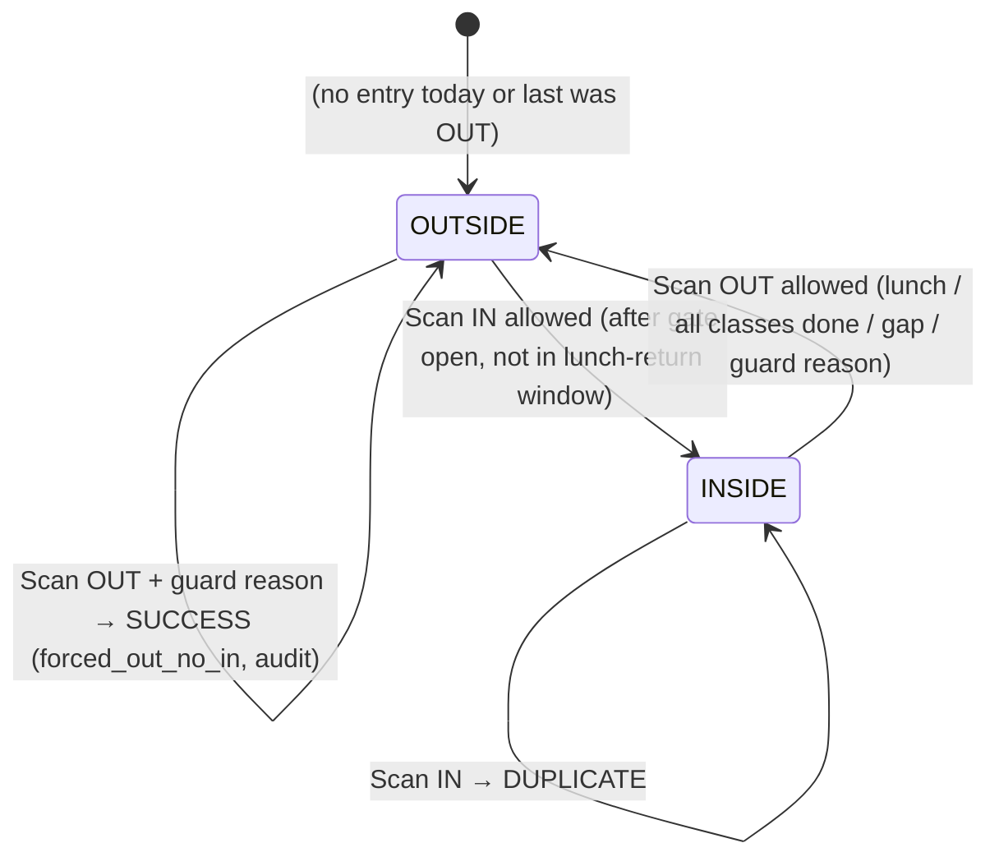
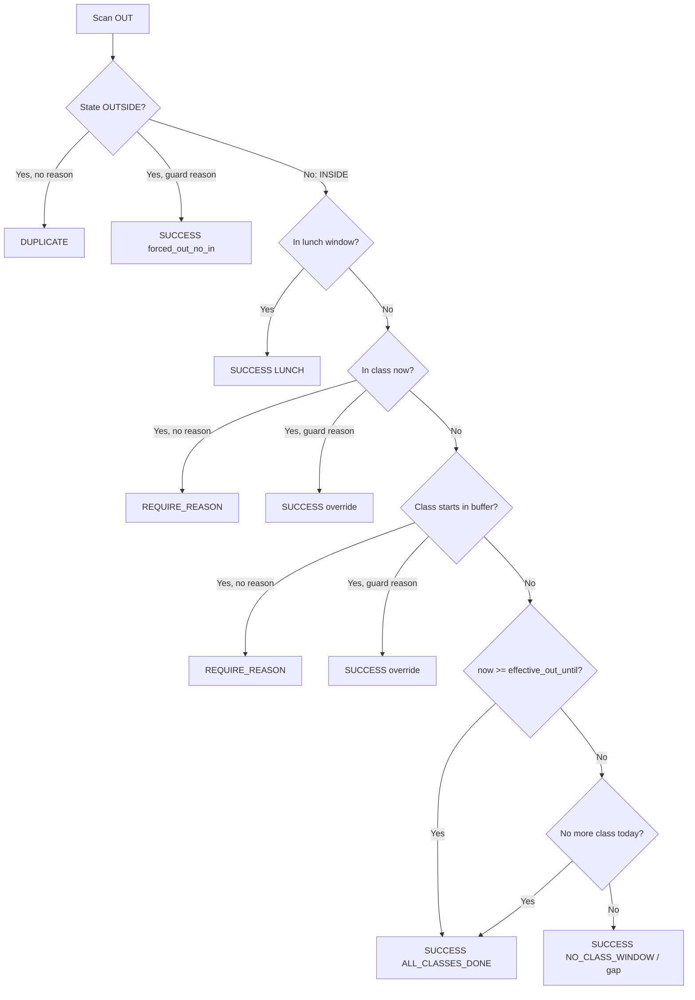

# Gate Entries – Full Logic Structure

How **gate entries** are created, listed, grouped into visits, and how they tie into policy, incidents, and events.

---

## 1. Model: GateEntry

**Location:** `gate/models.py`

| Field | Type | Purpose |
|-------|------|---------|
| `student` | FK(Student), null=True | Who was scanned (null if NOT_FOUND). |
| `event` | FK(Event), null=True | If this scan is for a specific event (event tracking); null = daily gate. |
| `granted` | BooleanField, default=True | True = allowed in/out, False = denied (always has linked incident). |
| `incident` | OneToOne(GateIncident), null=True | Set when entry was denied; links to the incident record. |
| `notes` | TextField | Legacy: stores "IN" or "OUT"; also used for visitor notes. |
| `scan_type` | CharField | 'IN' or 'OUT' (preferred over notes for logic). |
| `result` | CharField | SUCCESS, DENIED, DUPLICATE, BLOCKED, NOT_APPROVED, NOT_FOUND. |
| `out_reason` | TextField | Free-text reason for early/forced out (e.g. guard override). |
| `out_reason_code` | CharField | Code for analytics: LUNCH, NO_CLASS_WINDOW, OVERRIDE_BY_GUARD, etc. |
| `timestamp` | DateTimeField, auto_now_add=True | When the entry was recorded (timezone-aware). |
| `recorded_by` | FK(User), null=True | Guard/user who recorded (audit). |

**Indexes:** `timestamp`, `(scan_type, timestamp)`, `(student, timestamp)`.

**Display / grouping:**  
- “IN” vs “OUT” is determined by `scan_type` if set; else `notes` (strip, uppercase) for legacy rows.  
- Entries with `event_id is None` = **daily gate**; with `event_id` set = **event-specific** (event attendees).

---

## 2. Creation Paths (who creates GateEntry)

All creation is in `gate/gate_views.py`. There are **six** code paths that create a `GateEntry`.

### 2.1 Manual record (grant) – `record_entry`

- **URL:** `POST /gate/record/`
- **When:** Guard uses “Record entry” and chooses **Grant**.
- **Creates:**  
  `GateEntry(student=student, granted=True, notes=notes, recorded_by=request.user)`  
  No `scan_type`/`result`/`event`/`out_reason_code` (legacy-style).
- **Side effect:** `EventAttendance.get_or_create` for all active events (participated=False).

### 2.2 Manual record (deny) – `record_entry`

- **URL:** `POST /gate/record/`
- **When:** Guard chooses **Deny** (with reason).
- **Creates:**  
  1. `GateIncident(student, scanned_id, reason, details, guard_alerted=True)`  
  2. `GateEntry(student=student, granted=False, incident=incident, notes=notes, recorded_by=request.user)`  
- **Side effect:** `notify_denied_entry(incident, …)` (email if configured).

### 2.3 Visitor pass scan – `save_scan`

- **URL:** `POST /gate/save-scan/`
- **When:** Scanned ID starts with `VISITOR-` and pass is valid/unused.
- **Creates:**  
  `GateEntry(student=guest, granted=True, notes="Visitor: {name} ({code})", recorded_by=request.user)`  
  (Guest student is get_or_create student_id='GUEST'.)

### 2.4 Daily gate / event scan (success) – `save_scan`

- **URL:** `POST /gate/save-scan/`
- **When:**  
  - Student is registered and active; not blocked by `StudentBlock`;  
  - **Event path:** selected event, and not “already IN” for that event today (duplicate IN blocked);  
  - **Daily path:** either no “already scanned today as IN” (duplicate IN blocked), or status is OUT;  
  - Policy allows the scan (`evaluate_scan` → `allowed=True`).
- **Creates:**  
  `GateEntry(student=student, event=selected_event, granted=True, result='SUCCESS', scan_type=status, notes=status, out_reason=..., out_reason_code=..., recorded_by=request.user)`  
  `status` = 'IN' or 'OUT' (from manual_status or suggested).
- **Side effects:**  
  - If event: `EventAttendance.update_or_create(…, participated=True)`.  
  - For all active events: `EventAttendance.get_or_create(…, participated=False)`.

### 2.5 Record early out – `record_early_out`

- **URL:** `POST /gate/record-early-out/`
- **When:** Student was already scanned IN today at daily gate; guard records OUT (e.g. from “Already scanned today” popup with reason).
- **Pre-check:** Exists a granted, event__isnull=True entry today with last “direction” not OUT (so student is considered inside).
- **Policy:** `evaluate_scan(student, 'OUT', now_dt, guard_override_reason=reason)` must return `allowed=True`.
- **Creates:**  
  `GateEntry(student=student, granted=True, result='SUCCESS', scan_type='OUT', notes='OUT', out_reason=..., out_reason_code=..., recorded_by=request.user)`  
  No `event` (daily gate only).

### 2.6 Event QR scan (token or student ID) – `scan_event_qr`

- **URL:** `POST /gate/scan-event/`
- **When:** Event attendance scan (mobile/app) with valid token or student QR; scan is accepted.
- **Creates:**  
  `GateEntry(student=student, event=event, granted=True, notes=scan_type, recorded_by=recorded_by, timestamp=now)`  
  (`timestamp` set explicitly to `now` for consistency with event flow.)  
  Plus `AttendanceLog` for the event scan.

**Summary table**

| Source | granted | event | scan_type | result | incident |
|--------|---------|-------|-----------|--------|----------|
| record_entry (grant) | True | null | (default IN) | (default SUCCESS) | null |
| record_entry (deny) | False | null | (default) | (default) | set |
| save_scan (visitor pass) | True | null | (default) | (default) | null |
| save_scan (student/event success) | True | selected or null | IN/OUT | SUCCESS | null |
| record_early_out | True | null | OUT | SUCCESS | null |
| scan_event_qr | True | set | (notes=IN/OUT) | (default) | null |

---

## 3. Duplicate and “already today” logic

### 3.1 Event scan (in `save_scan`)

- **Today** = `timezone.localdate()`.
- **Day bounds** = `_local_day_bounds(today)` → `day_start`, `day_end`.
- **Already in event today:**  
  `GateEntry` with same student, same event, `granted=True`, `timestamp` in `[day_start, day_end)`, and latest entry’s notes not "OUT".
- If **already in** and current scan is **IN** → return “already checked in to this event” (no new entry).  
- OUT is allowed (second scan for same event same day).

### 3.2 Daily gate (in `save_scan`)

- **Today** = `timezone.localdate()`, same **day_start**/ **day_end**.
- **Entries today:**  
  `GateEntry.objects.filter(student=student, granted=True, event__isnull=True, timestamp__gte=day_start, timestamp__lt=day_end)`.
- **Latest today:** order by `-timestamp`; take first.
- **“Already today” (still inside):** latest exists and `(notes or '').strip().upper() != 'OUT'` (or equivalent using scan_type when set).
- If **already today and still inside** and current **status == 'IN'** → return “already scanned at gate today” (no new entry); UI can offer “Record OUT” (record_early_out).
- If status is **OUT** or not already today → continue to policy (`evaluate_scan`).

### 3.3 Record early out

- **Already today:** same as above (granted, event__isnull, today’s range).  
- If no such entry → 400 “Student has not been scanned in today. Use normal scan to record OUT.”  
- Then `evaluate_scan(student, 'OUT', …)` must allow (e.g. lunch window, class done, or guard reason).

---

## 4. Policy engine (allow / deny / require reason)

**Location:** `gate/policy.py`

The engine is a **deterministic state-based gate policy** with explicit override handling and boundary-safe time window evaluation. All branches return a consistent result shape so UI, logging, and analytics stay stable.

### 4.1 Student state (daily gate)

Gate state is derived from the last **granted** daily-gate entry today: last IN → `INSIDE`, last OUT or none → `OUTSIDE`. Transitions:



- **IN** is not allowed before gate open or during strict lunch-return window (no guard override).
- **OUT** from INSIDE may require a reason (in-class or class-soon buffer); guard reason overrides to SUCCESS. OUT from OUTSIDE with no prior IN today is DUPLICATE unless guard provides reason (then SUCCESS with `forced_out_no_in`).

### 4.2 OUT decision flow (policy order)

OUT is evaluated in this order; first match wins:



*Lunch window* = `[lunch_out_start, lunch_in_start)`. *effective_out_until* = max(general_out_until, last_class_end_today) when load slip exists.

### 4.3 Policy API (summary)

- **`get_student_current_state(student, today, daily_gate_only=False)`**  
  Uses **local day bounds** for `today`. When `daily_gate_only=True`, only entries with `event=None` are considered.  
  - If last granted entry today is IN (by scan_type or notes) → `'INSIDE'`.  
  - Else → `'OUTSIDE'`.

- **`evaluate_scan(student, scan_type, now, guard_override_reason=None, ...)`**  
  Returns dict: `allowed`, `result`, `message`, `schedule_hint`, `next_suggested`, `out_reason_code`, `out_reason_text`, `deny_reason`, and when applicable `forced_out_no_in`.

  - **IN:**  
    - If state is INSIDE → DUPLICATE (no duplicate IN).  
    - If before gate open (and no guard override) → DENIED.  
    - If strict lunch return and now in lunch-out window → DENIED.  
    - Else → SUCCESS.  
  - **Note:** IN does **not** use guard override for “before gate open” or “lunch return window”; guard cannot override those (by design).

  - **OUT:**  
    - If state is OUTSIDE and no guard reason → DUPLICATE (scan IN first).  
    - If state is OUTSIDE but guard provides reason → SUCCESS with `out_reason_code='OVERRIDE_BY_GUARD'` and `forced_out_no_in=True` (audit).  
    - Lunch window → SUCCESS (LUNCH).  
    - In class now → guard reason → SUCCESS (early exit); else REQUIRE_REASON.  
    - Class starts within buffer → guard reason → SUCCESS; else REQUIRE_REASON.  
    - No more class today or after effective_out_until → SUCCESS (ALL_CLASSES_DONE).  
    - Else (gap / return later) → SUCCESS (NO_CLASS_WINDOW).

Policy uses **GatePolicy** (gate open time, lunch windows, etc.) and schedule helpers (e.g. `in_class_now`, `has_class_after`) from load slip data.

**Only `save_scan` (daily path) and `record_early_out`** call `evaluate_scan`.  
`record_entry` does not; it only records guard’s grant/deny.

*Refinement note:* Today both “already INSIDE” (duplicate IN) and “already OUTSIDE” (duplicate OUT) return `result='DUPLICATE'`. If analytics need to distinguish them later, consider separate codes (e.g. `ALREADY_INSIDE` / `ALREADY_OUTSIDE`).

---

## 5. Listing and filtering (entry_list)

**View:** `entry_list` in `gate/gate_views.py`  
**URL:** `/gate/entries/`  
**Query params:** `from_date`, `from_time`, `q` (search), `filter` (granted/denied/in/out), `embed`.

**Logic:**

1. **Base queryset:**  
   `GateEntry.objects.select_related('student', 'incident', 'event').order_by('-timestamp')`.

2. **Search (`q`):**  
   student_id, first/middle/last name, notes, out_reason (icontains).

3. **Filter:**  
   - `granted` → `granted=True`  
   - `denied` → `granted=False`  
   - `in` → `notes__iexact='IN'`  
   - `out` → `notes__iexact='OUT'`

4. **Date:**  
   If `from_date` provided: parse to `filter_date`, then **local day bounds** `day_start`, `day_end` for that date; filter `timestamp__gte=day_start`, `timestamp__lt=day_end`.  
   If `from_time` also provided: add `timestamp__gte=start_dt` (start of that time on filter_date).

5. **Cap:** `entries = list(entries_qs[:200])`.

6. **Split:**  
   - `entries_student_only` = entries with `event_id is None` (daily gate).  
   - `entries_event_only` = entries with `event_id` set.

7. **Visits (grouping):**  
   - `visits = _gate_entries_to_visits(entries_student_only)`  
   - `event_visits = _gate_entries_to_visits(entries_event_only)`  
   Same date filter is applied to **visitors** and **incidents** for the same day (for tabs); incidents can also be filtered by `from_time` and search `q`.

8. **Incident/proxy display:**  
   For each visit, resolve linked incident (student_id or scanned_id) and whether proxy was already reported for that date, so the UI can show “Report proxy” or “Reported”.

**Context passed to template:**  
`entries`, `visits` (with incident and already_reported), `event_visits`, `visitors`, `incidents`, `q`, `filter`, `from_date`, `from_time`, and optionally `embed=True`.

---

## 6. Visit grouping: _gate_entries_to_visits

**Location:** `gate/gate_views.py`

**Input:** List of `GateEntry` (e.g. daily-gate entries only, or event-only). Caller must already filter by local day bounds so all entries belong to the intended calendar day(s).

**Logic:**

- **Grouping key:** `(student_id, local_date)` where `local_date = timezone.localtime(timestamp).date()`. Using local date keeps grouping consistent with `_local_day_bounds`; using `timestamp.date()` would use UTC date and can split one local day across two buckets near midnight.
- **IN/OUT:** Prefer `scan_type`; if unset, use `notes` (e.g. `notes.strip().upper() == 'OUT'`). Matches policy and avoids misclassifying entries like `notes='OUT (force: …)'` when `scan_type='OUT'`.
- Within each group, sort by `timestamp`.
- Walk in order:  
  - If entry is OUT → emit `(None, out_entry)` (forced OUT with no IN, or orphan OUT).  
  - If entry is IN and next is OUT → emit `(in_entry, out_entry)` and skip next.  
  - Else IN with no following OUT → emit `(in_entry, None)`.
- Sort all visits by the timestamp of the first non-None entry (desc).

**Output:** List of `(in_entry, out_entry)` where either can be None.  
Used so the Gate entries list can show **one row per visit** (IN + OUT) instead of two raw rows. Duration is **not** computed here; UI/analytics can compute from `in_entry.timestamp` and `out_entry.timestamp` when both are present.

### 6.1 Edge cases (verified)

| Case | Entries (same student, same local day) | Expected visit(s) |
|------|----------------------------------------|-------------------|
| Normal visit | IN 08:00, OUT 12:00 | `(IN 08:00, OUT 12:00)` |
| Single IN (still inside) | IN 08:00 | `(IN 08:00, None)` |
| Forced OUT (no IN) | OUT 10:00 | `(None, OUT 10:00)` — no duration; no cross-day pair |
| Two INs (legacy/duplicate) | IN 08:00, IN 09:00 | `(IN 08:00, None)`, `(IN 09:00, None)` |
| OUT then IN then OUT | OUT 08:00, IN 09:00, OUT 12:00 | `(None, OUT 08:00)`, `(IN 09:00, OUT 12:00)` — never `(OUT 08:00, IN 09:00)` |
| Two full visits | IN 08:00, OUT 10:00, IN 13:00, OUT 17:00 | `(IN 08:00, OUT 10:00)`, `(IN 13:00, OUT 17:00)` |

Midnight / timezone: Callers pass entries already filtered by `_local_day_bounds(today)`; grouping by local date ensures that one local day stays one group even when UTC date crosses midnight.

---

## 7. Counts used elsewhere (same “today” definition)

These use **local day bounds** so they match the entry list and each other:

- **Dashboard / Analytics “today”:**  
  `_local_day_bounds(today)` then:  
  - Granted count: `_granted_visits_count_for_date(today)` (filters granted, same bounds, then `_gate_entries_to_visits` and len).  
  - Denied: `GateEntry` with `granted=False` in that range.  
  - Incidents: `GateIncident` in that range.

- **Guard dashboard:**  
  Same bounds; total_entries (granted count) and denied_entries from entries in that range.

- **Reports hub:**  
  Same bounds for entries and for `AttendanceLog` (scan_time) “today”.

### 7.1 Timezone and day bounds (single source of truth)

**Definition:** `_local_day_bounds(date)` in `gate/gate_views.py` returns `(day_start, day_end)`:

- `tz = timezone.get_current_timezone()` (app timezone, e.g. Asia/Manila)
- `day_start = timezone.make_aware(datetime.combine(date, time.min), tz)` → midnight local
- `day_end = day_start + timedelta(days=1)` → next midnight (exclusive)

All “today” or “for this date” filters must use:

```python
timestamp__gte=day_start, timestamp__lt=day_end
```

(no `__date=` or raw `timestamp.date()` in queries; store is UTC, so date() would be UTC date.)

**Call sites that use `_local_day_bounds` or the same formula:**

| Site | Usage |
|------|--------|
| `_granted_visits_count_for_date` | `_local_day_bounds(date)` |
| `save_scan` (event + daily) | `_local_day_bounds(today)` for duplicate checks |
| `record_early_out` | `_local_day_bounds(today)` for “already today” |
| `entry_list` | `_local_day_bounds(filter_date)` for entries, visitors, incidents |
| `event_attendees_embed` | `_local_day_bounds(filter_date)` |
| Dashboard (gate_views + gate_analytics) | `_local_day_bounds(today)` |
| `send_daily_digest` (notifications) | `_local_day_bounds(date)` |
| `clear_entries_today` / `clear_incidents_today` | `_local_day_bounds(today)` |

**Policy:** `get_student_current_state` in `gate/policy.py` cannot import `gate_views` (circular). It uses the same formula (tz, make_aware(combine(date, time.min), tz), day_end = day_start + 1 day); a comment in code states it must match `_local_day_bounds`.

**Visit grouping:** `_gate_entries_to_visits` groups by `timezone.localtime(entry.timestamp).date()` so one local day stays one bucket even when UTC date crosses midnight.

---

## 8. Event attendees embed

**View:** `event_attendees_embed`  
**URL:** `/gate/entries/event-attendees/?event_id=...&from_date=...`

- Filters **GateEntry** by `event_id` and by **local day bounds** for `filter_date` (from `from_date`).
- Builds `event_visits = _gate_entries_to_visits(entries)`.
- Renders `gate/event_attendees_embed.html` (used e.g. beside event title on gate scan when tracking an event).

---

## 9. Incident link and “Report proxy”

- **Denied entry:** `record_entry` (deny) creates `GateIncident` and `GateEntry(granted=False, incident=incident)`. So one incident, one entry; entry shows in list with incident reason.

- **Report proxy:**  
  `report_proxy_attendance` creates **only** `GateIncident` (reason=proxy_attendance, student/scanned_id set).  
  No new `GateEntry` is created.  
  The **entry list** still shows that student’s visit (granted entry); the Incidents tab and the “Incident” column for that visit show the proxy incident by matching student_id (or scanned_id) and date.  
  So “Report proxy” does not create a second gate entry; it only adds an incident record for the same day/person.

---

## 10. URLs and templates (gate entries)

| URL | View | Template |
|-----|------|----------|
| `/gate/entries/` | `entry_list` | `gate/entry_list.html` (or `entry_list_embed.html` if `embed`) |
| `/gate/entries/event-attendees/` | `event_attendees_embed` | `gate/event_attendees_embed.html` |

Entry list template: tabs for **Student entries** (visits), **Event attendees** (event_visits), **Visitors**; and **Incidents** tab with “Report proxy” and incident list for the same date.

---

## 11. End-to-end flow (daily gate, one student)

1. **First scan IN (e.g. morning)**  
   - `save_scan` with student_id, no event (or event but first IN for that event).  
   - Lookup student; check active, not blocked; **daily path:** no granted event__isnull entry today with last != OUT, and status=IN → not “already today”.  
   - **Policy:** `evaluate_scan(student, 'IN', now)` → allowed (note that policy now checks the student’s load‑slip: entries are denied when the slip shows *no classes today*, and will require a guard reason if the scan occurs outside any scheduled class time).
2. **Second scan IN same day (duplicate)**  
   - Same student, status=IN.  
   - **Daily path:** there is a granted event__isnull entry today and latest is not OUT → “already scanned at gate today” returned; no new entry.  
   - UI can offer “Record OUT” (record_early_out) with reason.

3. **Record OUT (e.g. lunch or end of day)**  
   - Either:  
     - **Normal scan** with status OUT → `save_scan` allows (state was INSIDE), policy allows OUT → create GateEntry(OUT).  
     - Or **Record early out** → `record_early_out` checks “already today” and policy allows OUT (reason or window) → create GateEntry(OUT).  
   - State becomes OUTSIDE.

4. **List view**  
   - User opens Gate entries, picks date (or today).  
   - `entry_list` filters by local day bounds, builds visits via `_gate_entries_to_visits(entries_student_only)`.  
   - One row per visit (IN time, OUT time, incident if any, “Report proxy” if not yet reported).

This is the full structure of the gate entries logic: model, all six creation paths, duplicate/today checks, policy, listing with visits and incidents, and how “today” is defined consistently everywhere.
